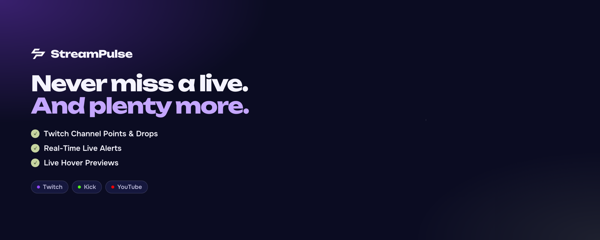
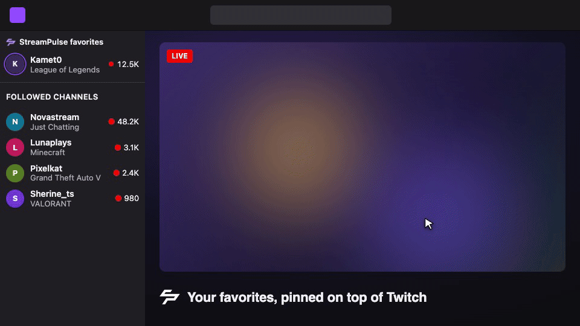
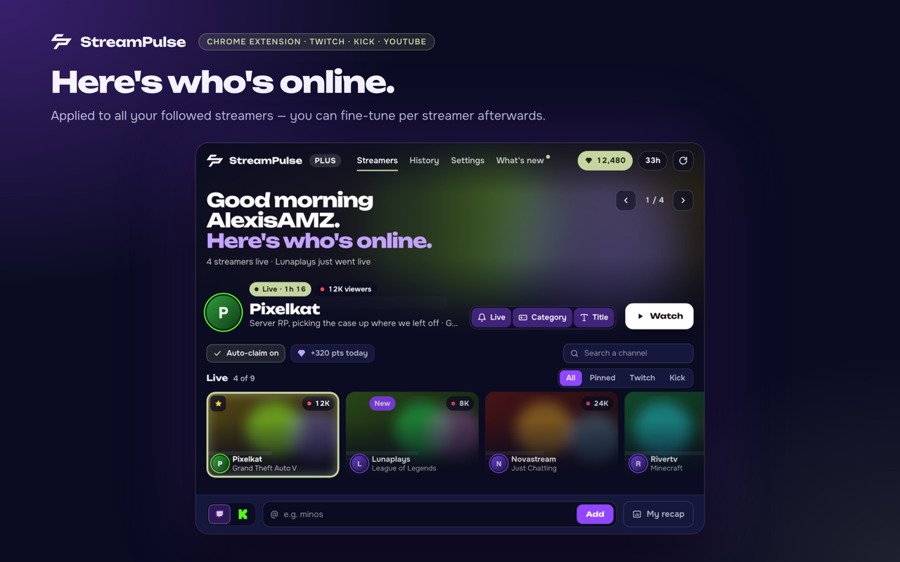
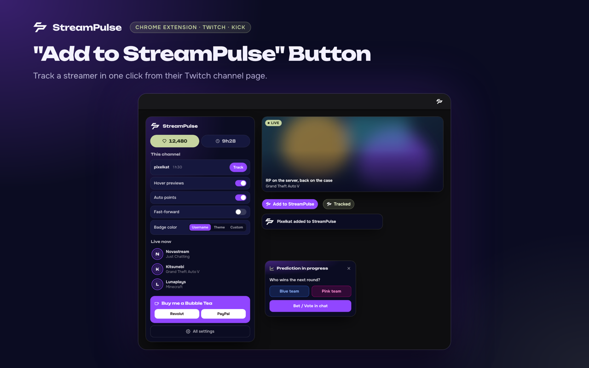
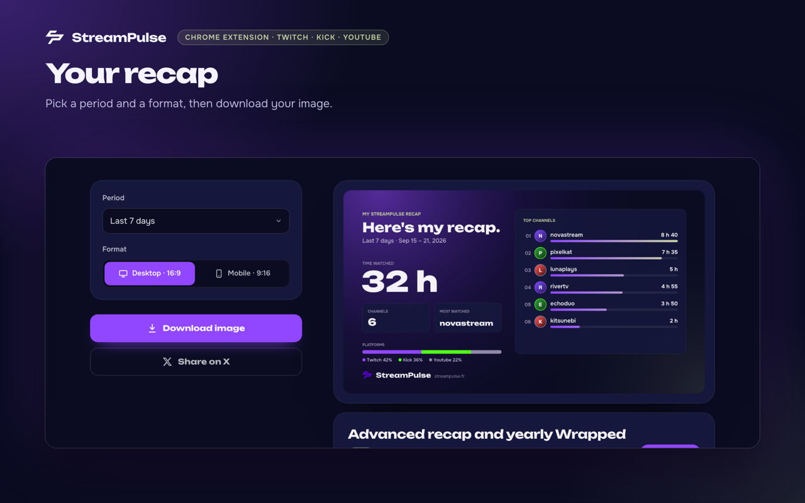

<p align="center">
  
</p>

<h1 align="center">StreamPulse</h1>

<p align="center">
  <strong>The Twitch & Kick companion that tells you who's live, claims your channel points and Drops, and lives right inside Twitch.</strong>
</p>

<p align="center">
  <a href="https://chromewebstore.google.com/detail/streampulse-multi-streame/ipfhbfabadbpkjimhdcjadopnahdpddh"></a>
  <a href="https://chromewebstore.google.com/detail/streampulse-multi-streame/ipfhbfabadbpkjimhdcjadopnahdpddh"></a>
  <a href="https://addons.mozilla.org/firefox/addon/streampulse-twitch-kick/"></a>
  <a href="https://github.com/AlexisAMZ/streampulse-extension/stargazers"></a>
  
  <a href="LICENSE"></a>
</p>

<p align="center">
  <a href="https://chromewebstore.google.com/detail/streampulse-multi-streame/ipfhbfabadbpkjimhdcjadopnahdpddh"><b>Chrome</b></a> ·
  <a href="https://addons.mozilla.org/firefox/addon/streampulse-twitch-kick/"><b>Firefox</b></a> ·
  <a href="https://www.streampulse.fr/">Website</a> ·
  <a href="#features">Features</a> ·
  <a href="#privacy">Privacy</a> ·
  <a href="#contributing">Contributing</a>
</p>

<p align="center">
  <sub>If StreamPulse saves you a click, <a href="https://github.com/AlexisAMZ/streampulse-extension/stargazers">a ⭐ on GitHub</a> helps other viewers find it.</sub>
</p>

---

## Why StreamPulse

You follow streamers on two platforms, Twitch buries your favorites under recommendations, and channel points only drop if you're there to click. StreamPulse fixes all three from one lightweight extension, with no account and no ads.

It works **alongside** BetterTTV, FrankerFaceZ and 7TV: they customize chat, StreamPulse handles alerts, rewards and your streamer list.

<p align="center">
  
</p>

<p align="center">
  
</p>

## Features

### 🔔 Know who's live
- **One dashboard for Twitch and Kick.** Live channels first, with viewers, category and uptime.
- **Desktop alerts** when a streamer goes live, and optionally when they change title or category.
- **Hover previews** of a live stream (image or video) straight from Twitch links.

### ⭐ Right inside Twitch
- **StreamPulse favorites in the Twitch sidebar**, above your followed channels, with live status. Pin or unpin with the star on any channel card.
- **Settings panel on Twitch.** Open StreamPulse from the top bar without leaving the stream.
- **"Add to StreamPulse" button** on every Twitch channel page.

### 🎁 Rewards on autopilot
- **Channel points bonuses** claimed automatically while you watch.
- **Twitch Drops** claimed as soon as they're ready.
- Points earned on Kick are counted too.

### 🎬 A smoother player
- **Anti-pause:** the stream keeps playing when you switch tabs.
- **Player recovery** after errors like Twitch `#2000`.
- **Chat filters** by keyword or user, on Twitch and Kick.

### 📊 Your watch time
- Time watched per channel, and a **shareable recap image** for 7 days, 30 days or any month, in 16:9 or 9:16.

<p align="center">
  
  
</p>

### ✨ StreamPulse+ (optional)
Animated name and badge effects in Twitch chat, visible to other StreamPulse users. Everything above stays free; StreamPulse+ is how the project pays for itself.

## Install

| Browser | Link |
|---|---|
| Chrome, Brave, Opera, Vivaldi | [Chrome Web Store](https://chromewebstore.google.com/detail/streampulse-multi-streame/ipfhbfabadbpkjimhdcjadopnahdpddh) |
| Firefox 128+ | [Firefox Add-ons](https://addons.mozilla.org/firefox/addon/streampulse-twitch-kick/) |
| Microsoft Edge | Coming soon on Edge Add-ons (the Chrome Web Store version works today) |

Click the StreamPulse icon, type a Twitch or Kick username, and you're set.

### Run from source

```bash
git clone https://github.com/AlexisAMZ/streampulse-extension.git
cd streampulse-extension
npm install
npm test
```

Then open `chrome://extensions`, turn on **Developer mode**, click **Load unpacked** and pick the folder.

## Privacy

- No account, no ads, no trackers.
- Your streamers, settings and watch time stay in your browser's local storage.
- The **community badge** sends a hash of your Twitch username (never the name itself) to our server at most once a day. Turn it off in Settings.
- **StreamPulse+** checks your license key with our server.

Full policy: [streampulse.fr/privacy](https://www.streampulse.fr/privacy)

## Contributing

Bug reports, ideas and pull requests are welcome.

- **Found a bug?** [Open an issue](https://github.com/AlexisAMZ/streampulse-extension/issues/new) with your browser, the page and what happened.
- **Speak another language?** Every string lives in [`i18n/translations.js`](i18n/translations.js). Fixes and new languages are easy first contributions.
- **Sending code?** Run `npm run lint` and `npm test` before opening the PR.

## License

StreamPulse is free software under the [GNU General Public License v3.0](LICENSE). You can use, study, modify and share it; any distributed copy or fork must stay open source under the same license.

## Star history

<a href="https://star-history.com/#AlexisAMZ/streampulse-extension&Date">
  
</a>

---

<p align="center">
  Made by <a href="https://github.com/AlexisAMZ">AlexisAMZ</a> · <a href="https://x.com/alexisamz_">X</a> · <a href="https://instagram.com/alexisamz">Instagram</a> · <a href="https://www.streampulse.fr/support">Support</a>
</p>
